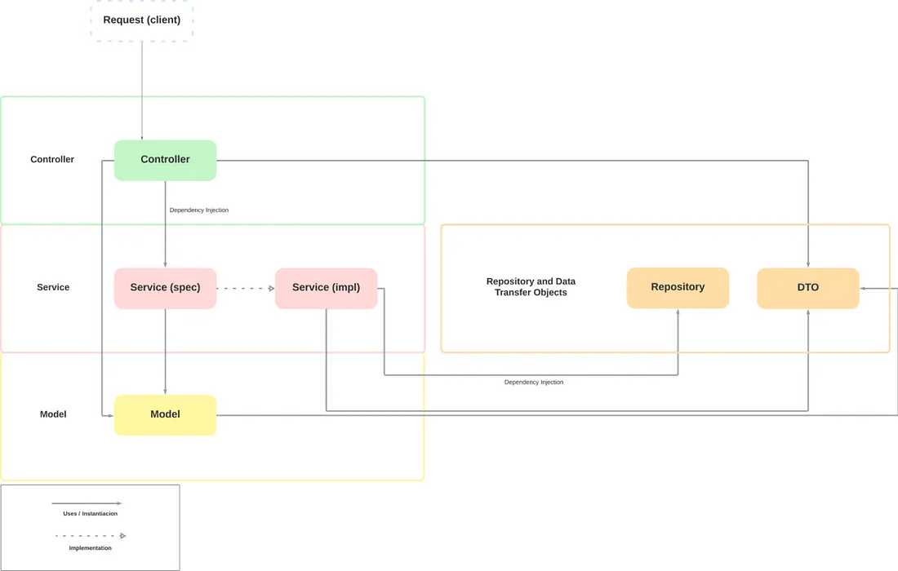
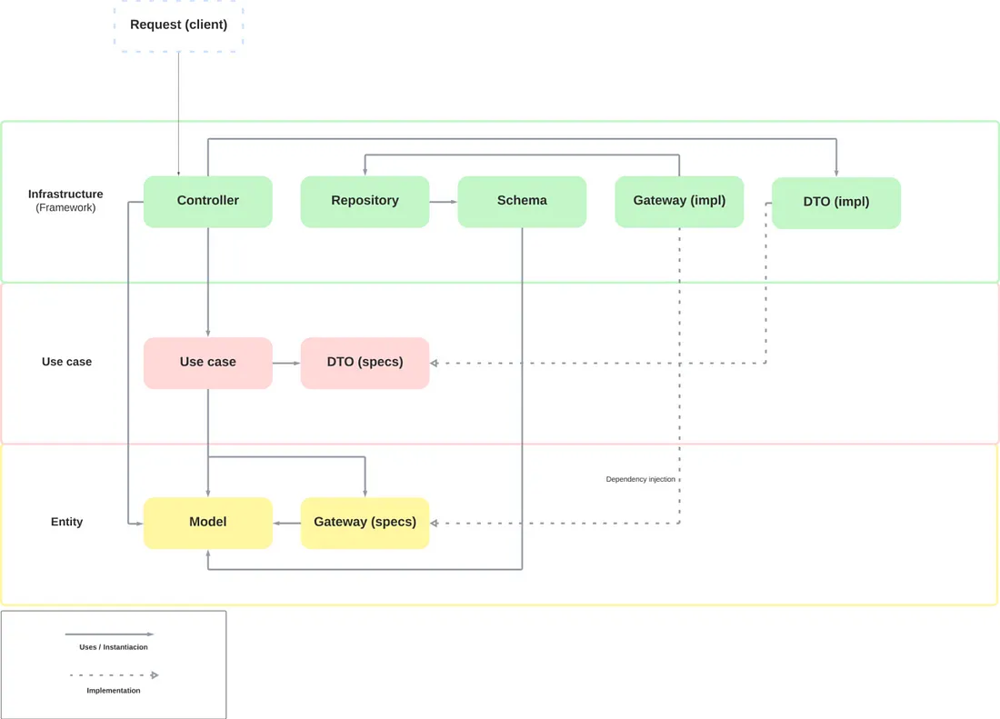

# SpringBoot Clean Architecture
* https://medium.com/@viniciusromualdobusiness/clean-architecture-with-spring-boot-a-good-idea-d6f97e450130
### AS-IS

```
bikerental
│
├── config
│   ├── AcceptHeaderResolver.java
│   └── MvcConfig.java
│
├── controller
│   ├── AdminController.java
│   ├── ...
│
├── domain
│   ├── AbstractEntity.java
│   ├── ...
│
├── dto
│   ├── admin
│   │   ├── AdminDetails.java
│   │   ├── ...
│   ├── ...
│
├── exception
│   └── ErrorsHandler.java
│
├── repository
│   ├── IAdminRepository.java
│   ├── ...
│
├── service
│   ├── impl
│   │   ├── AdminService.java
│   │   ├── ...
│   └── spec
│       ├── IAdminService.java
│       ├── ...
│
├── validation
│   ├── ...
│
└── VirtualBikeRentalsApplication.java
```
### TO-BE

```
bikerental
│
├── entity
│   ├── AbstractEntity.java
│   ├── admin
│   │   ├── exception
│   │   │   └── AdminNotFoundException.java
│   │   ├── gateway
│   │   │   └── AdminGateway.java
│   │   └── model
│   │       └── Admin.java
│   ├── customer
│   │   ├── ...
│   ├── rental
│       ├── ...
│
├── infrastructure
│   ├── admin
│   │   ├── controller
│   │   │   ├── CreateAdminController.java
│   │   │   ├── ...
│   │   ├── dto
│   │   │   ├── AdminPublicData.java
│   │   │   ├── ...
│   │   └── gateway
│   │       └── AdminDatabaseGateway.java
│   ├── config
│   │   ├── db
│   │   │   ├── repository
│   │   │   │   ├── AdminRepository.java
│   │   │   │   ├── ...
│   │   │   └── schema
│   │   │       ├── AdminSchema.java
│   │   │       ├── ...
│   │   ├── ...
│   ├── customer
│   │   ├── ...
│   ├── rental
│       ├── ...
│
├── usecase
│   ├── admin
│   │   ├── CreateAdminUseCase.java
│   │   ├── ...
│   │   ├── dto
│   │   │   ├── IAdminPublicData.java
│   │   │   ├── ...
│   ├── customer
│   │   ├── ...
│   ├── rental
│   │   ├── ...
│   └── rentalCompany
│       ├── ...
│
└── VirtualBikeRentalsApplication.java
```